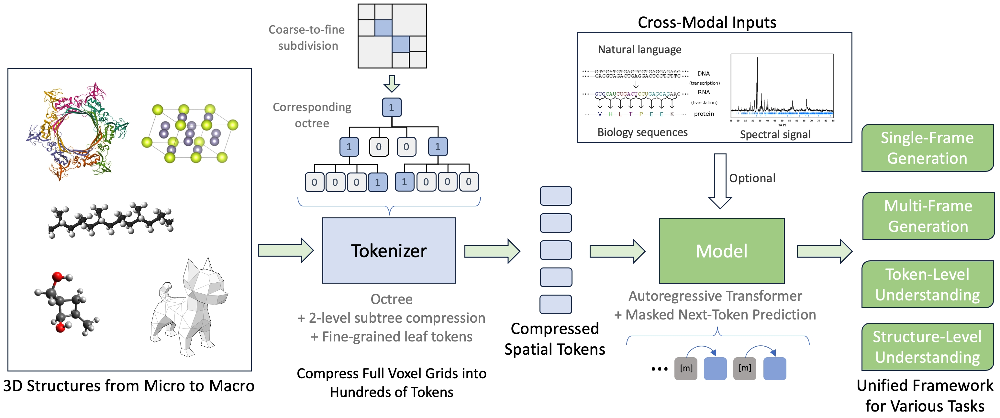

Uni-3DAR
========
[[Paper](https://arxiv.org/pdf/2503.16278)]

Introduction
------------

<p align="center"></p>
<p align="center"><b>Schematic illustration of the Uni-3DAR framework</b></p>

Uni-3DAR is an autoregressive model that unifies various 3D tasks. In particular, it offers the following improvements:

1. **Unified Handling of Multiple 3D Data Types.**  
   Although we currently focus on microscopic structures such as molecules, proteins, and crystals, the proposed method can be seamlessly applied to macroscopic 3D structures.

2. **Support for Diverse Tasks.**  
   Uni-3DAR naturally supports a wide range of tasks within a single model, especially for both generation and understanding.

3. **High Efficiency.**  
   It uses octree compression-in combination with our proposed 2-level subtree compression-to represent the full 3D space using only hundreds of tokens, compared with tens of thousands in a full-size grid. Our inference benchmarks also show that Uni-3DAR is much faster than diffusion-based models.

4. **High Accuracy.**  
   Building on octree compression, Uni-3DAR further tokenizes fine-grained 3D patches to maintain structural details, achieving substantially better generation quality than previous diffusion-based models.


News
----

**2025-03-21:** We have released the core model along with the QM9 training and inference pipeline.


Dependencies
------------

- [Uni-Core](https://github.com/dptech-corp/Uni-Core). For convenience, you can use our prebuilt Docker image:  
  `docker pull dptechnology/unicore:2407-pytorch2.4.0-cuda12.5-rdma`


Reproducing Results on QM9
--------------------------

To reproduce results on the QM9 dataset using our pretrained model or train from scratch, please follow the instructions below.

### Download Pretrained Model and Dataset

Download the pretrained checkpoint (`qm9.pt`) and the dataset archive (`qm9_data.tar.gz`) from our [Hugging Face repository](https://huggingface.co/dptech/Uni-3DAR/tree/main).

### Inference with Pretrained Model

To generate QM9 molecules using the pretrained model:

```
bash inference_qm9.sh qm9.pt
```

### Train from Scratch

To train the model from scratch:

1. Extract the dataset:
```
tar -xzvf qm9_data.tar.gz
```

2. Run the training script with your desired data path and experiment name:

```
base_dir=/your_folder_to_save/ bash train_qm9.sh ./qm9_data/ name_of_your_exp
```


Citation
--------

Please kindly cite our papers if you use the data/code/model.

```
@article{lu2025uni3dar,
  author    = {Shuqi Lu and Haowei Lin and Lin Yao and Zhifeng Gao and Xiaohong Ji and Weinan E and Linfeng Zhang and Guolin Ke},
  title     = {Uni-3DAR: Unified 3D Generation and Understanding via Autoregression on Compressed Spatial Tokens},
  journal   = {Arxiv},
  year      = {2025},
}
```


